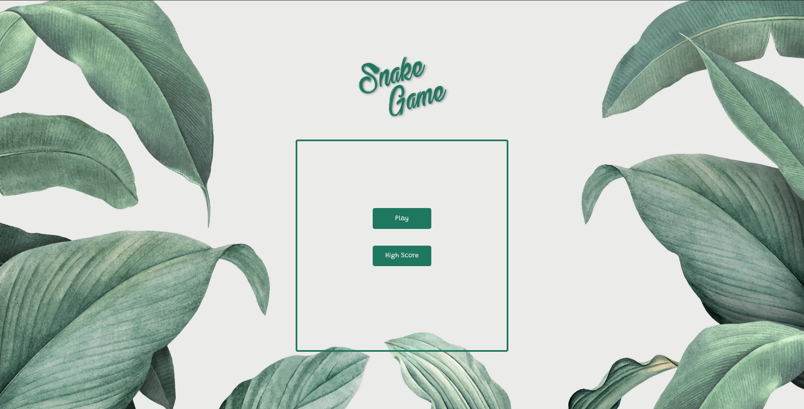
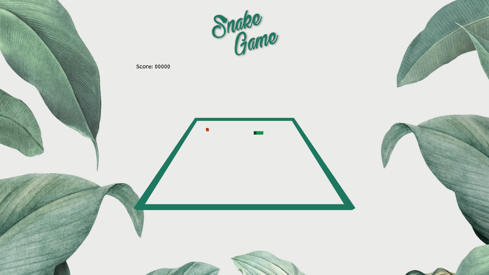

# Snake Game 3D

Projeto desenvolvido para a disiciplina de Computação Gráfica(INF1701) da Universidade Católica de Pernambuco(UNICAP).

**Exercício:** Desenvolver um jogo 3D em OpenGL

**Especificação:**

- Escolha o jogo 3D a ser desenvolvido. A interface gráfica possuirá uma única janela contendo tanto o painel contendo tanto a renderização do OpenGL quanto os componentes de interação com o usuário.
- Deve possuir visualização 3D: o usuário terá uma visão 3D do jogo, ao invés de uma visão 2D, e através de controle do usuário(ou situação do jogo) haver uma mudança de visualização de forma suave de um ponto de vista para outro.
- O usuário precisa interagir com o jogo via mouse e/ou teclado. Alternativamente,você pode utilizar joysticks ou qualquer outro tipo de controle mais avançado.
- O sistema deverá ter alguns objetos que possuam normal, materiais, etc., para que sejam iluminados corretamente pelo OpenGL.
- Pelo menos um objeto do seu jogo deve possuir textura.

**Desenvolvido com:** WebGL 2.0

**Fonte:**

- _Nome_: Bethanie Snake.ttf
- _Autor_: Gregory Medina, dcodesign 2019

**Screenshots:**

